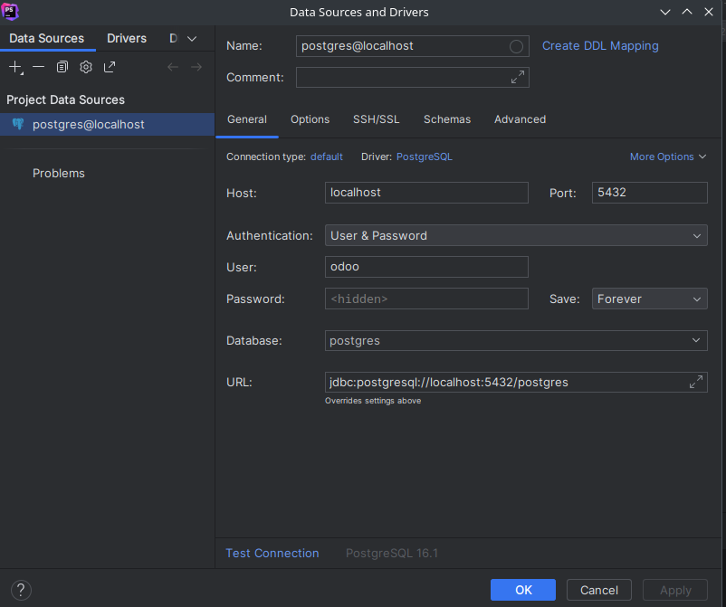
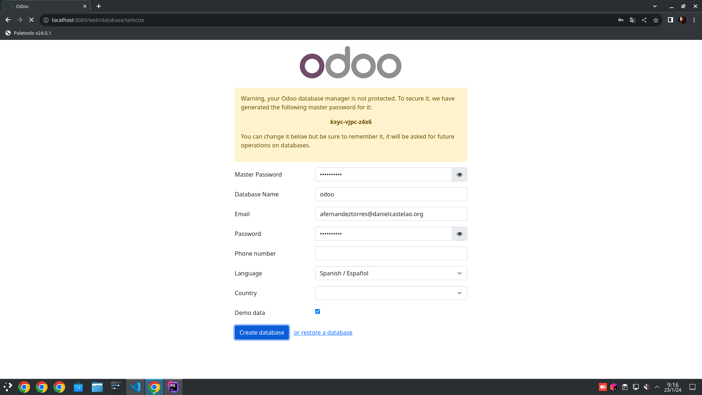
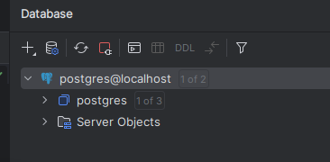
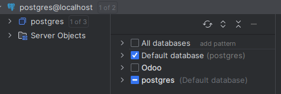

## Qué es Oddo?
Odoo es  un sistema de planificación de recursos empresariales (ERP) el cual es de código abierto. Nos permitira gestionar una empresa de forma integral, esto permite hacerlo desde la gestion de clientes, facturación, contabilidad, proovedores...
Para usarla simplemente necesitaremos una base de datos y un IDE que interprete Python.

## Docker-Compose

Necesitaremos crear el siguiente archvivo el cual es un docker-compose.yml

```yml
version: '3.1'

services:
  # odoo:
  web:
    image: odoo:16.0
    depends_on:
      - mydb
    ports:
      - "8069:8069"
    environment:
      - HOST=mydb 
      - USER=odoo
      - PASSWORD=odoo
```

## Postgres

Ahora mostraré el resto del código el cual servirá para crear la base de dator que nos permitira utilizar Odoo. En este caso usaremos postgres y crearemos un contenedor.

Asegurate de no tener el puerto de postgres ocupado. En caso de que este ocupado sigue los siguientes pasos: [Solución puerto ocupado](#puerto)

```yml
 # postgres:
  mydb:
    image: postgres
    ports:
      - "5432:5432"
    environment:
      POSTGRES_DB: postgres
      POSTGRES_PASSWORD: odoo
      POSTGRES_USER: odoo
```

#### Comprobar que la base de datos está en funcionamiento

En caso de que estes usando PHPStorm nos iremos al botón de la derecha que dice Database y al clickarlo nos aparecera un apartado donde veremos todas nuestras bases de datos. Le daremos al +, luego a Add a Database y nos abrirá una ventana donde podremos seleccionar el servicio, usaremos postgres. Al elegir el servicio nos abrira otra ventana donde configuraremos la base de datos. Tendremos que poner el nombre de la base de datos, el usuario y la contraseña. Cuando tengamos todo configurado le daremos a Test Connection y si la conexión es correcta clicka en Apply y luego en Ok y ya tendríamos la base de datos configurada.




<a id="puerto"> </a>
#### Solucion si el puerto esta ocupado
En caso de que el puerto no este disponible usaremos el siguiente comando para comprobar quien lo está usando:

```bash 
sudo nettest -putan | grep 5432
```
en caso de que salga un proceso el cual lo este usando debemos cerrarlo con el siguiente comando: 

```bash
sudo kill nombre_proceso
```


### Iniciar docker-compose 

Para ello deberemos usar este comando `docker-compose up -d` y cuando termine de iniciarlo ya deberiamos poder visualizar la pagina. En caso de que no debemos usar el siguiente comando y comprobar que no haya errores en el codigo `docker compose down`.

### Comprobar funcionamiento
Para verificar si Odoo esta en funcionamiento debemos irnos al navegador y escribir el siguiente url `localhost:8069` y debería aparecernos la pagina de inicio de sesión de Odoo .




Recuerda que en el aparatado Database Name debes poner un nimbre distinto al de la pase de datos de postgres del docker compose sino nos dará error.


### Comprobar si la base de datos ha sido creada
En el mismo IDE en el cual hemos creado el docker-compose (en mi caso PHPStorm) le daremos al botón de la derecha donde dice Database y nos saldrá un apartado donde podremos ver las diferentes  bases de datos que tenemos. Le daremos a refrescar si al lado del servicio postgres nos aparece un uno. 



Y ahora debería salir que hay 1 de 2, le damos click y marcaremos la base de datos en la cual hemos configurado el odoo.




### Partes del docker-compose

El archivo docker-compose se divide en varias partes las cuales las explicaré a continuación:

- services: Defome los servicios que forman parte de la aplicación.

  - web:
    
    - image: odoo:16.0: Define que el servicio web utilizará la imagen 
    
    - depends_on: - mydb: Indica que este servicio depende de otro servicio llamado mydb. Este debe estar en funcionamiento antes de que web se inicie.

    - ports: - "8069:8069": Mapea el puerto 8069 del contenedor al puerto 8069 del host, permitiendo el acceso al servicio desde fuera del contenedor.
    
    - environment: Define las variables de entorno para el servicio
        
      - HOST=mydb: Especifica el nombre del host de la base de datos (en este caso, el servicio mydb).

      - USER=odoo: Define el nombre de usuario para el servicio.

      - PASSWORD=odoo: Establece la contraseña para el servicio.

- mydb:

    - image: postgres: Utiliza la imagen oficial de postgres desde Docker Hub para el servicio de base de datos.

    - ports: - "5432:5432": Mapea el puerto 5432 del contenedor al puerto 5432 del host.

    - environment: Configura las variables de entorno para PostgreSQL:

        - POSTGRES_DB: postgres: Define el nombre de la base de datos predeterminada.

        - POSTGRES_PASSWORD: odoo: Establece la contraseña del usuario de la base de datos.

        - POSTGRES_PASSWORD: odoo: Establece la contraseña del usuario de la base de datos.


En este archivo se configuran dos servicios principales: Un servicio web que ejecuta Odoo y un servicio mydb el cual ejecuta una base de datos PostgresSQL. Los dos servicios están configurados para poder comunicarse entre sí. Las configuraciones de puerto nos permiten el acceso a estos servicios desde fuera de los contenedores.


